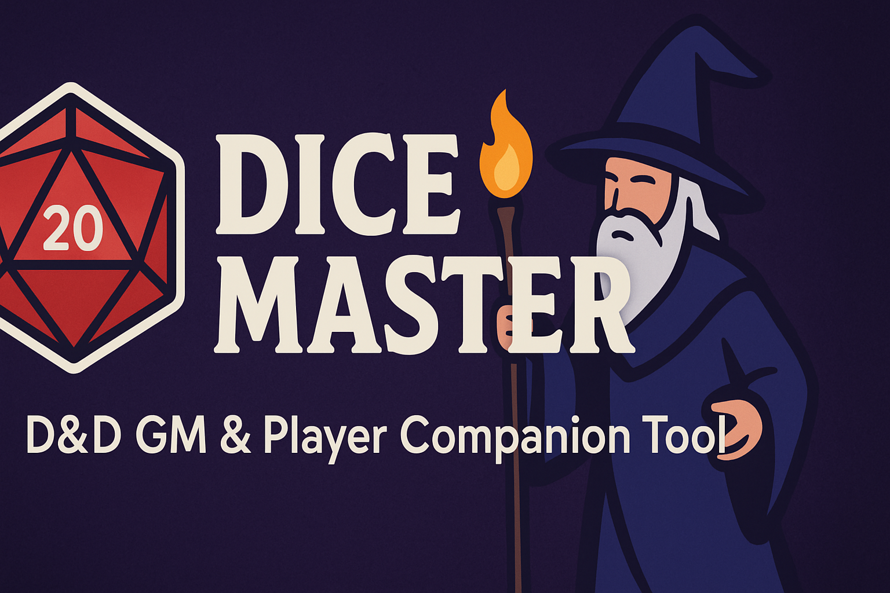

<p align="center">
  
</p>

# 🎲 Dice Master – D&D GM & Player Companion Tool

[](LICENSE)
[](https://flutter.dev)
[](CONTRIBUTING.md)

> **Your all-in-one Dungeons & Dragons session manager** – dice rolling, character sheets, session notes, and more. Built for both Game Masters and players, on mobile, web, and desktop.

---

## ✨ Features

- 🎲 **Advanced Dice Rolling** – Multiple dice types, modifiers, and custom roll settings.  
- 🧙 **Character Management** – Create, edit, and track characters with detailed stats.  
- 📜 **Session Tracking** – Notes, events, and history all in one place.  
- 🎨 **Custom Themes & Dark Mode** – Personalize the interface to match your campaign mood.  
- 🌍 **Multi-language Support** – Play in your preferred language.  
- 🔔 **Notifications** – Session reminders and event alerts.  
- 💾 **Backup & Restore** – Save and restore your campaign data.  
- ♿ **Accessibility-Friendly** – Designed with all players in mind.  
- 📈 **Built-in Analytics** – Track usage and performance.  
- 🌐 **Cross-Platform** – Works on Android, iOS, Web, Windows, and more.  

---

## 🚀 Quick Start

### 1. Clone the Repository
```bash
git clone https://github.com/maxstain/dice_master.git
cd dice_master
```

### 2. Install Dependencies
```bash
flutter pub get
```

### 3. Run the App
- **Mobile (Android/iOS)**  
  ```bash
  flutter run -d android
  flutter run -d ios
  ```
- **Web**  
  ```bash
  flutter run -d chrome
  ```
- **Desktop (Windows)**  
  ```bash
  flutter run -d windows
  ```

---

## 📅 Roadmap

### Core Features
- [ ] Advanced character customization  
- [ ] Expanded dice types and roll logic  
- [ ] Multiplayer session support  
- [ ] Custom game rules & settings  

### Experience Enhancements
- [ ] UI/UX improvements based on community feedback  
- [ ] More themes and visual customization  
- [ ] Tutorial mode for new users  
- [ ] Voice/video chat during sessions  

### Integrations & Expansion
- [ ] D&D resource/tool integration (DnDBeyond, Roll20, etc.)  
- [ ] Virtual tabletop support  
- [ ] Community marketplace for characters, sessions, and assets  

---

## 🤝 Contributing

We welcome all contributions!  
Check out the [Contributing Guide](CONTRIBUTING.md) to get started.  

Ways to contribute:
- Submit bug reports  
- Suggest or implement new features  
- Improve documentation  
- Create themes or translations  

---

## 📜 License
This project is licensed under the **MIT License** – see the [LICENSE](LICENSE) file for details.

---

## 📬 Contact & Community

- Open an [issue](https://github.com/maxstain/dice_master/issues) for bugs or suggestions  
- Email the maintainers directly for security concerns  
- Join our **D&D community** to share tips, homebrew content, and campaign stories  

---

## 🙏 Acknowledgements
Special thanks to the **Flutter community** for their tools and support, and to all contributors who help make Dice Master better.  
This is an independent fan project and is not affiliated with Wizards of the Coast or Dungeons & Dragons.

---

## 🔗 Resources

- [Dungeons & Dragons Official](https://dnd.wizards.com/)  
- [Roll20 Virtual Tabletop](https://roll20.net/)  
- [Fantasy Grounds](https://www.fantasygrounds.com/)  
- [DM Resources](https://koboldpress.com/kpstore/product-category/dm-resources/)  
- [Character Sheet Templates](https://www.dndbeyond.com/sheets)  

---
